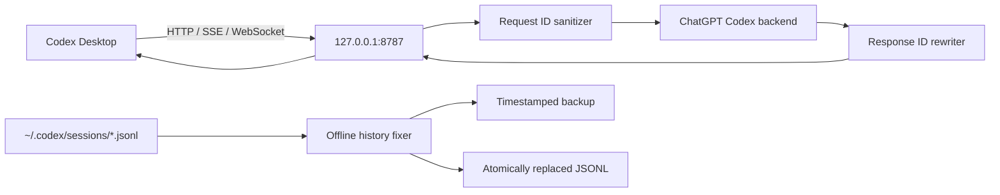

# Codex Bridge Toolkit for Windows

> **Codex Desktop session repair + ID-fix compatibility proxy + Antigravity/agy network helper for Windows.**  
> Windows 下的 Codex Desktop 会话修复、Responses API / SSE / WebSocket 本地兼容代理、Antigravity `agy` 专属代理与运行诊断工具。

[](https://github.com/zankzeke/codex-desktop-toolkit/actions/workflows/ci.yml)
[](LICENSE)

Codex Bridge Toolkit is designed for a specific compatibility problem: older or third-party-modified Codex sessions may contain synthetic item IDs such as `resp_<uuid>_msg` or `item_<hex>`. Replaying those sessions against the official Codex backend can lead to ID validation failures or stale reasoning references.

The toolkit provides both an **offline JSONL fixer** and a **local live proxy** for HTTP/SSE/WebSocket traffic.

> [!IMPORTANT]
> This project is **not affiliated with, endorsed by, or maintained by OpenAI**. It does not bypass model capacity, rate limits, authentication, billing, or account restrictions. The ChatGPT Codex backend used by the official client is an implementation detail and may change without notice.

## Features

- Structured `resp_<uuid>_msg -> msg_<uuid>` repair.
- Type-aware repair of synthetic `item_<hex>` IDs to `msg_`, `fc_`, `fco_`, `cc_`, or `cco_`.
- Safe handling of malformed reasoning items: non-official reasoning IDs are **not** blindly renamed to `rs_*`; unverifiable old reasoning traces are dropped and dangling references are cleaned up.
- No global string replacement inside user `content` / `text`.
- Local proxy bound to `127.0.0.1` only.
- HTTPS/SSE streaming rewrite without buffering the entire response.
- WebSocket bidirectional rewrite, subprotocol forwarding, close handling, and selected Codex upgrade metadata forwarding.
- Per-request/per-connection ID maps; concurrent streams do not share mutable request state.
- `config.toml` editing through `tomlkit`, with automatic backups and provider restore support.
- Offline session backups and atomic replacement.
- GUI for session scanning/fixing, proxy control, config injection, logs, and diagnostics.
- Optional PowerShell `agy` wrapper that temporarily sets proxy variables and restores the original shell environment afterward.

## Architecture



The default upstream currently used by this project is:

```text
https://chatgpt.com/backend-api/codex
```

The official Codex source currently defines the same ChatGPT Codex base URL. This is not a stability guarantee; future client/backend changes may require updates here.

## Download

For most Windows users, use the packaged build from **GitHub Releases**:

- [Latest Release](https://github.com/zankzeke/codex-desktop-toolkit/releases/latest)
- Download `CodexBridgeToolkit-v0.2.0-windows-x64.zip`.
- Extract it and keep `CodexBridgeToolkit.exe` and `CodexBridgeProxy.exe` in the same folder.
- Start `CodexBridgeToolkit.exe`.

The GUI includes four persistent themes: **午夜蓝 / 石墨黑 / 深海蓝 / 明亮**, a dedicated app icon, and Windows title-bar tinting where supported.

## Antigravity / `agy` helper

The **Antigravity 网络** tab installs an optional PowerShell wrapper for `agy`. Proxy variables are set only while `agy` is running and are restored afterward, so Codex, Git, Python, npm, and the rest of the shell are not globally proxied. The PowerShell profile is backed up before edits and the hook can be removed from the GUI.

## Requirements

- Windows 10 or Windows 11
- Python 3.11+
- Codex Desktop installed and signed in, if you want to use the GUI/config integration

## Quick start

### GUI (recommended)

Open PowerShell in the project directory and run:

```powershell
.\start-gui.ps1
```

The launcher creates `.venv` if needed, installs runtime dependencies, and starts the GUI.

Suggested workflow:

1. Open **代理控制 / Proxy Control**.
2. Leave **上游代理** empty unless your network requires an outbound HTTP proxy.
3. Start the local proxy and wait for the health check to become green.
4. Click **启用代理配置** to point Codex at `http://127.0.0.1:8787/v1`.
5. Restart Codex Desktop.
6. For an old broken thread, use **会话修复** to scan first, review the preview, then repair if necessary.

### Proxy only

```powershell
.\start.ps1
```

Optional examples:

```powershell
.\start.ps1 -Port 8787
.\start.ps1 -Upstream "https://chatgpt.com/backend-api/codex"
.\start.ps1 -UpstreamProxy "http://127.0.0.1:7890"
```

`-UpstreamProxy` is for an **HTTP proxy** supported by `aiohttp`.

### CLI offline fixer

Always preview first:

```powershell
python fix_codex_ids.py --fix-all --dry-run --verbose
```

Then apply:

```powershell
python fix_codex_ids.py --fix-all
```

To target paths containing a keyword:

```powershell
python fix_codex_ids.py --fix 2026-09-11 --dry-run
```

For safety, a real repair is refused while `Codex.exe` is running. `--force` exists for advanced users who explicitly accept the risk of concurrent writes.

## Codex config

The GUI writes a provider block similar to:

```toml
model_provider = "openai-idfix"

[model_providers.openai-idfix]
name = "OpenAI (ID-fix proxy)"
base_url = "http://127.0.0.1:8787/v1"
wire_api = "responses"
requires_openai_auth = true
supports_websockets = true
```

Before changing `config.toml`, the toolkit creates a backup. When you choose **恢复默认直连**, it tries to restore the provider that was active before `openai-idfix`; if that provider no longer exists, it falls back to `openai`.

## Why malformed reasoning is dropped

A server-issued `rs_*` reasoning item may correspond to server-side state, encrypted content, or metadata not reproducible by a local rename. Converting an arbitrary third-party `item_<hex>` into `rs_<hex>` can make the identifier look valid while still referring to state the server never created.

The default safe policy therefore does this:

- Keep server-style `rs_*` reasoning items.
- Drop synthetic/non-official reasoning items that cannot be safely reconstructed.
- Remove dangling `item_id`, `message_id`, `previous_item_id`, `parent_id`, and `response_id` references to dropped reasoning items.
- Preserve ordinary message history and user text.

## Transport behavior

### HTTPS / SSE

The proxy parses SSE line framing incrementally. A JSON event may arrive across arbitrary TCP chunks, and multiple events may arrive in one chunk; the toolkit rewrites complete `data:` lines as soon as they are available and passes `data: [DONE]` through unchanged.

### WebSocket

For WebSocket requests the proxy:

- connects to the upstream first;
- forwards offered subprotocols and mirrors the selected subprotocol downstream;
- forwards a small allowlist of Codex upgrade metadata such as `X-Reasoning-Included`, `OpenAI-Model`, `X-Models-Etag`, and `X-Codex-Turn-State`;
- rewrites structured JSON in both directions;
- passes binary frames through;
- tears down the opposite pump when either direction ends.

## Security model

The proxy is a compatibility layer, **not an authentication isolation boundary**.

- It listens on loopback only.
- Authorization/Cookie headers received from Codex are forwarded to the configured upstream because the upstream needs them to authenticate the request.
- The toolkit does not intentionally persist those credentials and does not log request/response bodies.
- Logged/diagnostic URLs redact embedded user-info and remove query strings.
- A custom upstream can receive Codex authentication headers. Only use an upstream you fully trust.
- Do not post real session JSONL, tokens, Cookie/Authorization headers, or unredacted request/response bodies in public issues.

See [SECURITY.md](SECURITY.md) for details.

## Development

Install development dependencies:

```powershell
python -m pip install -r requirements-dev.txt
```

Run checks:

```powershell
python -m compileall -q .
python -m pytest -q
```

CI runs the test suite on Windows with Python 3.11 and 3.13.

## Project layout

```text
codex_toolkit_gui.py   Tkinter GUI
proxy.py               HTTP / SSE / WebSocket compatibility proxy
id_rewriter.py         single source of truth for structured ID repair
sse_handler.py         SSE line framing and event rewrite
history_fixer.py       offline JSONL repair, backup, atomic replacement
fix_codex_ids.py       command-line offline fixer
config_manager.py      config.toml structural editing / provider restore
powershell_hook.py     optional agy PowerShell wrapper
diagnostics.py         local health/diagnostic helpers
start-gui.ps1          GUI bootstrap
start.ps1              proxy bootstrap
tests/                 regression/integration tests
```

## Troubleshooting

### `Selected model is at capacity`

This can be returned by the upstream Codex service. The toolkit does not create model capacity and cannot bypass it. If local proxy logs show a normal upstream connection followed by a capacity error, investigate upstream service/account routing separately.

### WebSocket fails but HTTPS/SSE works

VPNs, TUN adapters, enterprise proxies, TLS inspection, firewalls, or upstream WebSocket policy can affect WebSocket independently of HTTPS. Try the diagnostics panel and compare with a direct Codex run on the same network.

### Before changing old sessions

Close Codex Desktop and run a dry scan first. Repairs create backups with names similar to:

```text
rollout.jsonl.bak.20260911-120000-a1b2c3
```

Keep those backups until you have confirmed the repaired thread behaves normally.

## Contributing

Issues and pull requests are welcome. Please read [CONTRIBUTING.md](CONTRIBUTING.md), and never attach private Codex history or credentials to a public issue.

## License

MIT — see [LICENSE](LICENSE).

## Disclaimer

This is an unofficial community project. OpenAI, ChatGPT, and Codex are trademarks of their respective owner. Internal backend behavior may change at any time.
